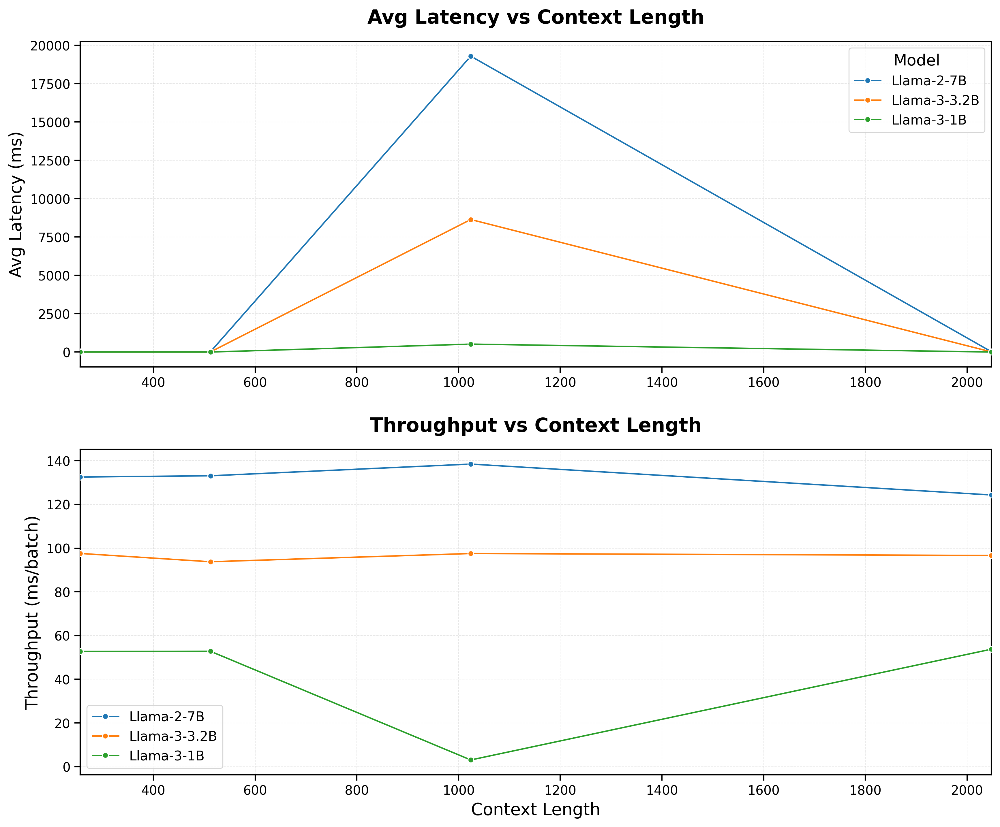
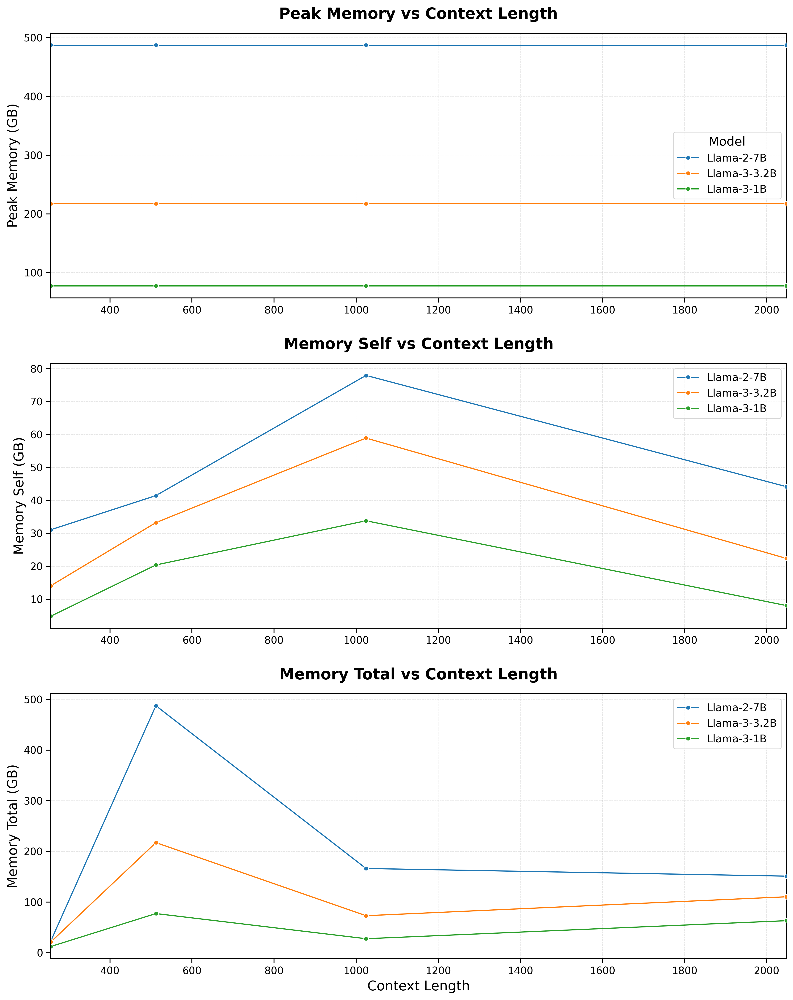
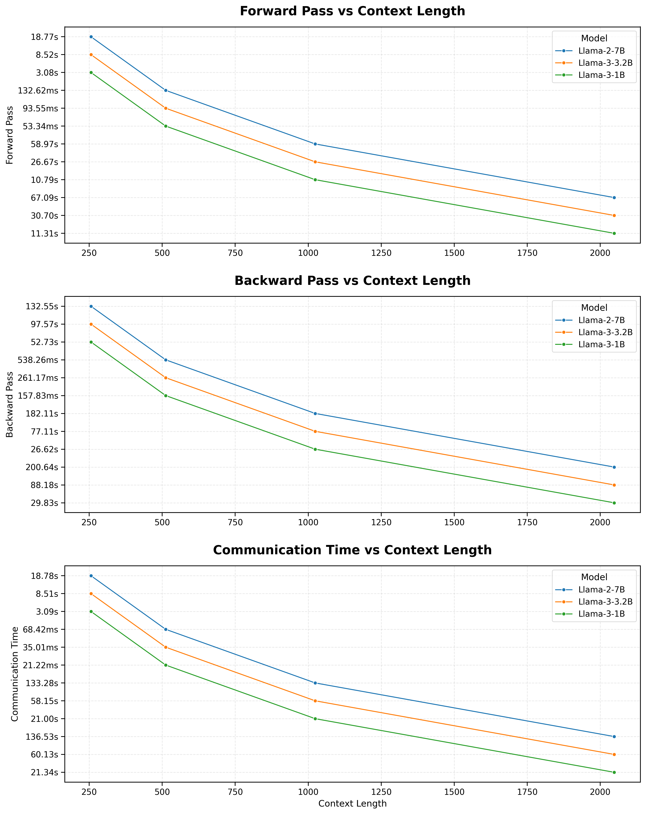

<center><h1>Scaling FlashAttention: Multi-GPU Implementation and Comparative Analysis on Llama Models</h1></center>

## Description of the Project
This project investigates the scalability and efficiency of Distributed FlashAttention for LLaMA models in resource-constrained environments. FlashAttention, a memory-efficient attention mechanism, is implemented and benchmarked on a 4-GPU high-performance computing (HPC) cluster using LLaMA2 7B and extended to LLaMA3 1B. The primary focus is on profiling Distributed FlashAttention’s performance using metrics such as bandwidth, latency, and memory usage to evaluate its utility for long-context training of large language models (LLMs).

## Project Milestones
- **Implementation of Distributed FlashAttention for LLaMA2 7B**: ✅ Completed  
- **Extension to LLaMA3 1B**: ✅ Completed  
- **Profiling and Benchmarking Performance**: ✅ Completed  
- **Identification of Scalability Patterns and Bottlenecks**: ✅ Completed  
- **Development of Recommendations for Future Deployments**: ✅ Completed  

## Repository and Code Structure
- `data_llama` folder contains the data used for profiling
- `llama2` folder contains the dist flash attention for llama2 7B model
- `llama3` folder contains the dist flash attention for llama3 1B model
- `data.py` is used for generating the sample data for profiling

## Commands to Execute the Code
- Python Requirements
    - For Lllama2: ``` llama2/requirements.txt ```
    - For Lllama3: ``` llama3/requirements.txt ```
- How to run the program:

Llama2 7B Model:
``` 
python3 -m torch.distributed.run --nproc_per_node=4 \
        LightSeq/lightseq/twp_v1.py \
    --model_name_or_path winglian/Llama-2-3b-hf \
    --data_path data.pkl \
    --fp16 \
    --output_dir outputs \
    --num_train_epochs 3    \
    --per_device_train_batch_size 1 \
    --per_device_eval_batch_size 1  \
    --gradient_accumulation_steps 1 \
    --evaluation_strategy no \
    --save_strategy steps \
    --save_steps 1000  \
    --save_total_limit 1 \
    --learning_rate 2e-5 \
    --weight_decay 0.  \
    --warmup_ratio 0.03  \
    --lr_scheduler_type "cosine" \
    --logging_steps 1  \
    --fsdp "full_shard auto_wrap" \
    --fsdp_transformer_layer_cls_to_wrap 'LlamaDecoderLayer' \
    --tf32 False  \
    --model_max_length 2048  \
    --gradient_checkpointing True  \
    --lazy_preprocess True
```
    
Llama3.2 1B Model:
``` 
python3 -m torch.distributed.run --nproc_per_node=4 \
        LightSeq/lightseq/twp_v2_llama3.py \
    --model_name_or_path unsloth/Llama-3.2-1B \
    --data_path data_llama3.pkl \
    --fp16 \
    --output_dir outputs \
    --num_train_epochs 3    \
    --per_device_train_batch_size 1 \
    --per_device_eval_batch_size 1  \
    --gradient_accumulation_steps 1 \
    --evaluation_strategy no \
    --save_strategy steps \
    --save_steps 1000  \
    --save_total_limit 1 \
    --learning_rate 2e-5 \
    --weight_decay 0.  \
    --warmup_ratio 0.03  \
    --lr_scheduler_type "cosine" \
    --logging_steps 1  \
    --fsdp "full_shard auto_wrap" \
    --fsdp_transformer_layer_cls_to_wrap 'LlamaDecoderLayer' \
    --tf32 False  \
    --model_max_length 2048  \
    --gradient_checkpointing True  \
    --lazy_preprocess True 
```

## Results and Observations


